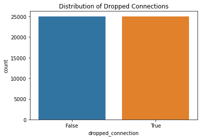

# Dropped Connection Prediction using network data
## Introduction

The goal of this machine learning project was to predict dropped mobile connections in networks. A lost connection, which occurs when a call or data session is abruptly ended, can degrade user experience and reveal deeper problems with network performance. Reducing these occurrences is essential for telecommunication companies to maintain high QoS(Quality of Service) and customer satisfaction.

 This notebook leverages a variety of network and device-level variables to create a predictive model by utilizing machine learning techniques. Network operators can take prompt remedial measures like load balancing, signal boosting, or client rerouting by precisely predicting the chance of a lost connection.

 ### Objectives
 - Create a binary classification model to predict if a mobile connection will stay steady (0) or be dropped (1).
 - Identify and interpret the most influential features—such as signal strength, jitter, and congestion level—that contribute to connection drops.
 - Train, validate, and assess the model using metrics like F1-score and confusion matrix.

## Business Understanding
Dropped connections in 5G networks degrade user experience and increase the risk of customer churn, directly impacting telecom revenue and brand reputation. By predicting dropped connections using real-time network and device data, telecom providers can shift from reactive fixes to proactive interventions—improving service reliability, reducing churn, and optimizing infrastructure investment.
This approach enables data-driven decision-making that enhances both operational efficiency and customer satisfaction.

## Data Understanding
The dataset consists of real-time measurements collected from mobile devices and network logs. It includes features such as signal strength, download and upload speeds, latency, jitter, congestion level, and network type. The target variable indicates whether a connection was dropped (1) or stable (0). Understanding the distribution and relationships between these features is crucial for building an effective predictive model.

#### Understanding the relevant columns
- Signal Strength(dBm) - Power level of the received signal. More negative = weaker signal (e.g., -100 dBm = poor).
- Network Type - 4G, 5G, LTE-A, etc.
- Download Speed(Mbps) - Data rate for downloads.
- Upload Speed(Mbps) - Data rate for uploads.
- Latency(ms) - Delay in data transmission
- Jitter(ms) - Variability in latency.
- Carrier - The mobile service provider or operator
- Band - The frequency band on which the device is operating (e.g., Band 78 for 5G)
- Connected duration - The total time (in minutes) that the device remained connected during a session
- Handover count - The number of times a device switches between cell towers or frequency bands during a session
- VoNR Enabled - Whether "Voice over New Radio" is turned on (used in 5G calling).
- Dropped Connection(Target) - 1 = Dropped, 0 = Stable
- Video Streaming Quality - Possibly 1–5 rating of stream quality

## Exploratory Data Analysis
To uncover insights from the network data, we explored the distribution and relationships of key features such as signal strength, latency, jitter, and handover count. Dropped connections were more frequent under poor signal conditions (e.g., below -90 dBm), high latency, and during sessions with multiple handovers—indicating instability in connectivity. We also observed class imbalance, with stable connections significantly outnumbering dropped ones, which suggests the need for resampling techniques before model training. Visualizations like histograms, box plots, and correlation matrices were used to highlight these trends and inform feature selection.

## Data Preprocessing
Before modeling, we cleaned and prepared the dataset by renaming columns for consistency, handling missing values, and converting units into standardized formats. Here, categorical variables such as carrier, network_type, and band will be encoded appropriately, while numerical features are scaled to ensure uniform contribution to the model. These steps ensure the data is well-structured and suitable for machine learning.

## Modeling using Logistic regression
Logistic Regression was chosen as the baseline model to predict dropped mobile connections using real-time 5G network data. Given the binary nature of the target variable (dropped_connection: 1 = yes, 0 = no), this model is well-suited to estimate the probability of a connection dropping based on features such as signal strength, latency, jitter, and handover count etc.

## Model Evaluation
We evaluate both models using multiple metrics:
- Accuracy: Overall correctness.
- Precision, Recall, F1-Score: Balance between false positives and false negatives.
- Confusion Matrix: Breakdown of true/false positives/negatives.
- ROC Curve and AUC: Discrimination ability across thresholds.
Accuracy: 0.50
The model correctly predicts the outcome 50% of the time, which is equivalent to flipping a coin in a balanced dataset. This indicates the model hasn't learned any meaningful patterns from the data.

Precision (Class 0 and 1 = 0.50)
For both classes (stable and dropped connections), the model only correctly predicts half of the positive predictions. For example, when the model predicts a dropped connection, it's right only 50% of the time.

Recall (Class 0 and 1 = 0.50)
The model captures only half of the actual stable or dropped connections, missing the other half. For example, it only finds 50% of all true dropped connections.

F1-score (All = 0.50)
The F1-score balances precision and recall. A score of 0.50 again suggests the model is no better than random chance.

Support
There were 4,994 stable and 5,006 dropped connections in the test set—balanced classes, which confirms that the poor performance is not due to class imbalance.

In conclusion, the model is underfitting as it is not capturing meaningful relationships in the data.

## Decision trees
Accuracy: 0.4979
The model correctly predicts whether a connection is stable or dropped approximately 50% of the time, which is comparable to flipping a coin. This suggests the model is struggling to learn distinct patterns from the data features.

Precision (Stable = 0.50, Dropped = 0.50)
The model is equally likely to be wrong or right when it predicts either class. For instance, when it predicts a dropped connection, it’s correct only 50% of the time.

Recall (Stable = 0.61, Dropped = 0.38)
The model identifies 61% of actual stable connections, but only 38% of true dropped connections, meaning it misses a significant number of critical drop events. This imbalance in recall is concerning for real-world applications where detecting dropped connections is crucial.

F1-Score (Stable = 0.55, Dropped = 0.43)
The F1-score is higher for stable connections, but drops for the dropped connections, indicating worse balance of precision and recall for the minority performance class. Overall performance is still weak, showing the model's limited predictive reliability.

Support
The test dataset includes a balanced class distribution (4,994 stable vs. 5,006 dropped connections), confirming that the poor results are not due to class imbalance, but rather a limitation in the model’s ability to learn useful patterns from the data.

## Conclusion
The primary objective of the analysis was to predict dropped 5G network connections using various technical and contextual features. Two models—Logistic Regression and Decision Tree—were evaluated.

- Despite preprocessing, feature scaling, and handling class imbalance, both models exhibited limited predictive performance:

- The accuracy of both models was modest, and precision/recall scores were low for the minority class (dropped connections).

The Logistic Regression ROC AUC indicated some ability to distinguish classes, but the actual classification performance (especially for detecting dropped connections) was weak.

The confusion matrices suggest that the models are biased toward the majority class (non-dropped connections), likely due to class imbalance and overlapping feature distributions.

These findings suggest that the current features and data quality are insufficient for building a reliable predictive model for dropped 5G connections.

## Next steps
1. Engineer key features - engineer new features like time-of-day indicators, signal strength variability or interactions between latency and jitter to uncover hidden patterns
2. Use a more robust model - given the performance of this model, running experiments with ensemble-based classifiers such as Random forest or XGBoost, which can model complex relationships more effectively than linear or shallow models
3. Apply stratified cross-validation and probability threshold tuning to ensure consistent and meaningful performance across all subsets of the data
